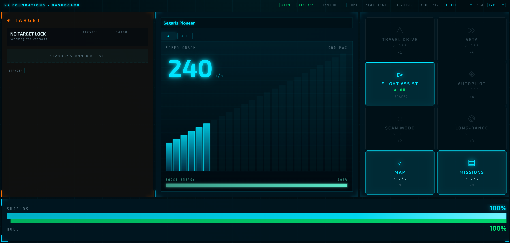
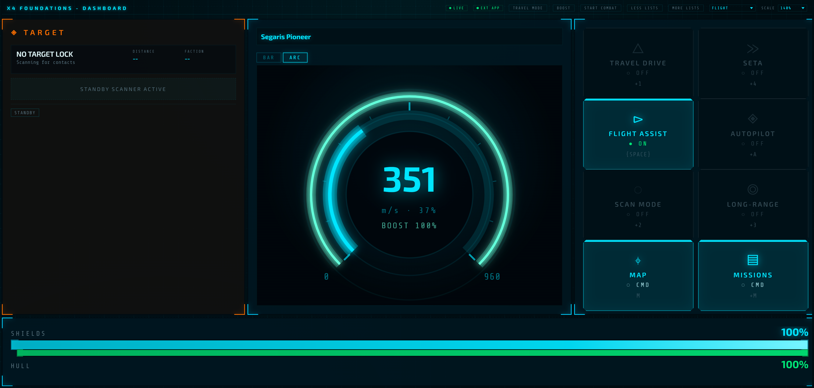

# X4 Dashboard

> A browser-first cockpit dashboard and server launcher for X4: Foundations.

`x4-dashboard` combines:

- a React + Arwes dashboard UI
- a Node.js server that aggregates game state
- a Lua bridge mod for X4
- a Windows Electron Server Launcher for easy local hosting

The main product direction is simple: run one server, then open the dashboard from browsers on the same machine or other devices on your LAN.

## ✨ Highlights

- Live ship, combat, mission, research, and comms telemetry
- Browser-based multi-device cockpit layouts
- Host-side key press integration with configurable bindings
- Mock mode for previewing the full dashboard without starting X4
- Windows Server Launcher that shows local and LAN URLs

## 🖼️ Screenshots

### Flight dashboard



### Flight dashboard - ARC speedometer



### Operations dashboard


## 🚀 Quick Start

### 1. Install dependencies

```bash
npm run install:all
```

### 2. Preview with mock data

```bash
npm run dev:mock
```

Then open `http://localhost:3001`.

### 3. Test the Server Launcher in mock mode

```bash
npm run desktop:mock
```

This starts:

- the mock server
- the Vite client
- the Electron Server Launcher

## 🎮 Running with the Real Game

This repository is source-only. The production frontend in `server/public/` is generated locally and ignored by Git.

Build the frontend:

```bash
npm run build
```

Start the server:

```bash
npm start
```

Open the dashboard from:

- `http://localhost:3001` on the host machine
- `http://<your-lan-ip>:3001` on other devices in the same trusted network

## 🖥️ Server Launcher

The Electron app is a **Server Launcher**, not the main dashboard client.

It is responsible for:

- starting the local server
- showing local and LAN URLs
- editing host-side settings
- editing host-side key bindings
- opening the server log location

Run it in development:

```bash
npm run desktop:dev
```

Run it against the locally built production app:

```bash
npm run build
npm run desktop:start
```

Build Windows artifacts:

```bash
npm run desktop:dist
```

Artifacts are written to `release/`.

## 🌐 Browser-First Client Model

The intended usage model is:

1. start the server on one machine
2. point the Lua mod at that machine
3. open the dashboard from browsers on tablets, laptops, side monitors, or other nearby devices

That makes `x4-dashboard` much better suited to multi-screen cockpit setups than a native-client-only architecture.

## 🔐 Safety Notes

This app can simulate local key presses on the machine where the server is running.

- Use it only on a trusted local machine or private LAN
- Do not expose the server directly to the public internet
- Remote control is localhost-only by default unless enabled from the Server Launcher
- The game window may need focus or borderless mode for reliable input

## 📦 Release Artifacts

Current release packaging is split into separate artifacts:

- `x4-dashboard-server-<version>.zip` / `.tar.gz` - standalone server package
- `x4-dashboard-lua-mod-<version>.zip` - standalone X4 Lua mod package
- `x4-dashboard-server-launcher-<version>-portable.exe` - portable Windows launcher
- `x4-dashboard-server-launcher-<version>-setup.exe` - Windows installer

Build release bundles locally:

```bash
npm run release:bundle
```

Build release validation:

```bash
npm run release:check
```

## ⚙️ Host Settings

The following host-side settings now live in the Server Launcher:

- allow remote controls
- AutoHotkey executable path
- force activate game window
- game window title matching
- key bindings used for host-side key press simulation

These values are persisted server-side for the machine running the host.

### Environment variables

Environment variables still exist, but they should mainly be treated as startup defaults or advanced overrides.

| Variable | Default | Description |
| --- | --- | --- |
| `PORT` | `3001` | Server port |
| `MOCK` | unset | Forces mock mode when set to `true` |
| `AUTOHOTKEY_PATH` | unset | Explicit path to `AutoHotkey64.exe` |
| `X4_FORCE_ACTIVATE` | `false` | Try to focus the game window before sending keys |
| `X4_WINDOW_TITLE` | `X4` | Window title fragment used for focus matching |
| `ALLOW_REMOTE_CONTROLS` | `false` | Allows remote access to `/api/keypress` and keybinding management |

Precedence notes:

- `PORT` and `MOCK` are still startup-time settings
- host control settings should be changed in the Server Launcher
- env vars act as defaults until launcher-managed runtime settings are saved

## 🧩 X4 Mod Setup

The Lua bridge source lives in `game-mods/x4_dashboard_bridge/`.

For releases, use the dedicated Lua mod zip and copy the included folder into your X4 extensions directory:

```text
X4 Foundations/extensions/x4_dashboard_bridge/
```

The packaged extension uses its own X4 content id, so it does not conflict with the original Mycu mod.

Config inside the packaged extension:

```lua
host = '127.0.0.1'
port = 3001
```

If your dashboard server runs on another LAN machine, point `host` to that machine.

## 🛠️ Development

Main commands:

```bash
npm run dev            # Vite + server
npm run dev:mock       # Vite + mock server
npm run desktop:dev    # Vite + server + launcher
npm run desktop:mock   # Vite + mock server + launcher
npm run build          # build client into server/public/
npm run typecheck      # main validation step
npm run release:check  # typecheck + frontend build
npm run desktop:dist   # build Windows launcher artifacts
npm run release:bundle # build standalone server + Lua bundles
```

Current validation status:

- no dedicated automated test suite yet
- no linter configured yet
- `npm run typecheck` is the main code validation command

## 🧠 Architecture Overview

Data flow:

1. the X4 Lua mod posts widget payloads to `POST /api/data`
2. `server/utils/normalizeData.js` strips X4 formatting codes
3. `server/dataAggregator.js` merges partial updates into durable game state
4. the server broadcasts game state over WebSocket
5. browser dashboards render the live state and call `POST /api/keypress` for host-side actions

## 📁 Project Layout

```text
x4-dashboard/
|- client/                     React + TypeScript frontend
|- electron/                   Windows Server Launcher
|- game-mods/x4_dashboard_bridge/ Lua bridge source
|- server/                     Express + WebSocket backend
|- server/public/              Generated frontend build output
|- docs/screenshots/           README screenshots
```

## 🤝 Project Docs

- `CONTRIBUTING.md` - contribution guide
- `SECURITY.md` - security policy
- `RELEASE.md` - release checklist
- `ROADMAP.md` - current roadmap
- `CHANGELOG.md` - release history
- `AGENTS.md` - instructions for coding agents

## ⚠️ Known Limitations

- The project is playable, but still evolving
- Remote hosting is not a supported security model
- Some launcher and LAN workflows are still being refined for `v1.2.0`
- There is still no automated test suite

## 🙏 Credits

Special thanks to Mycu, author of X4 External App, for the original mod that proved out this integration path.

## 📄 License

MIT - see `LICENSE`.
